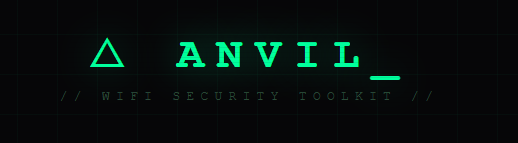

# Anvil-F


**Anvil-F** is an experimental ESP32-C5–based tool for Wi-Fi network analysis and testing.

The project is under active development. The current goal is to provide a practical and accessible diagnostic tool for wireless networks. In the long term, Anvil-F is intended to evolve into a full-featured toolkit for Wi-Fi technicians and network specialists.

---

## Disclaimer

Anvil-F is intended strictly for legal testing, diagnostics, and educational purposes.

The authors do not condone and are not responsible for any misuse of this software, including but not limited to:

* unauthorized access to networks
* disruption of network services
* any unlawful activity

You are solely responsible for complying with all applicable laws and regulations in your jurisdiction.

---

## Features (v1.0 beta)

* Wi-Fi network scanning
* Client discovery
* Access point health analysis (experimental)
* Web-based control interface
* UART CLI interface

---

# Installation and Flashing

## 1. Get the source

```bash
git clone https://github.com/AnvilBrain/Anvil-f.git
cd Anvil-f
cd anvil-f
```

---

## 2. Activate ESP-IDF environment

Ensure ESP-IDF is installed and properly configured.

Activate the environment before flashing.

---

## 3. Flash the device (ESP32-C5)

**Important:** ESP32-C5 uses bootloader offset **0x2000**.

It is strongly recommended to erase flash before the first installation:

Replace the serial port with the one used by your system.
```bash
esptool.py --chip esp32c5 --port COM12 erase_flash
```

Then flash the firmware:

**Windows (cmd)**

```bash
esptool.py --chip esp32c5 --port COM12 --baud 460800 write_flash ^
  0x2000 firmware/bootloader/bootloader.bin ^
  0x8000 firmware/partition_table/partition-table.bin ^
  0x10000 firmware/anvil-f.bin
```

**Linux/macOS**

```bash
esptool.py --chip esp32c5 --port /dev/ttyUSB0 --baud 460800 write_flash \
  0x2000 firware/bootloader/bootloader.bin \
  0x8000 firmware/partition_table/partition-table.bin \
  0x10000 firmware/anvil-f.bin
```
Open serial monitor on your esp32-c5 port
---

# After Flashing

After successful boot, Anvil-F can be operated in two modes.

## CLI Mode

Control the device via a UART terminal.

Refer to the CLI documentation for the full command list.

---

## Web Interface

Start the web interface from the CLI:

```
web
```

The device will start its access point and the Web UI will become available in the browser.

Refer to the Web Interface documentation for details.

---

# Documentation

* CLI Guide — see `/docs/cli.md`
* Web Interface — see `/docs/web.md`

---

# Roadmap

Planned improvements include:

* enhanced network analyzer
* expanded telemetry and metrics
* improved Web UI stability
* additional diagnostic capabilities
* workflow improvements for Wi-Fi technicians
* Flipper Zero integration
* Bluetooth Classic and BLE tooling
